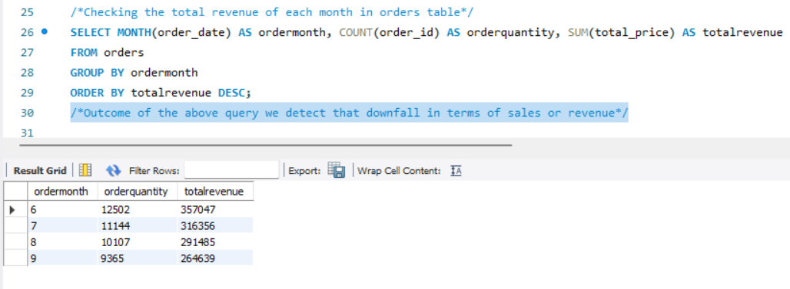
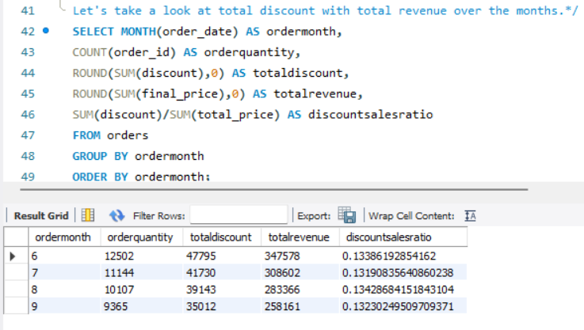
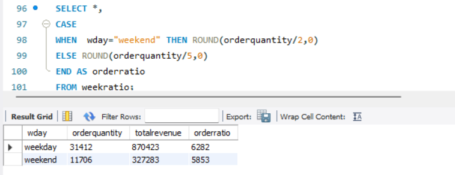
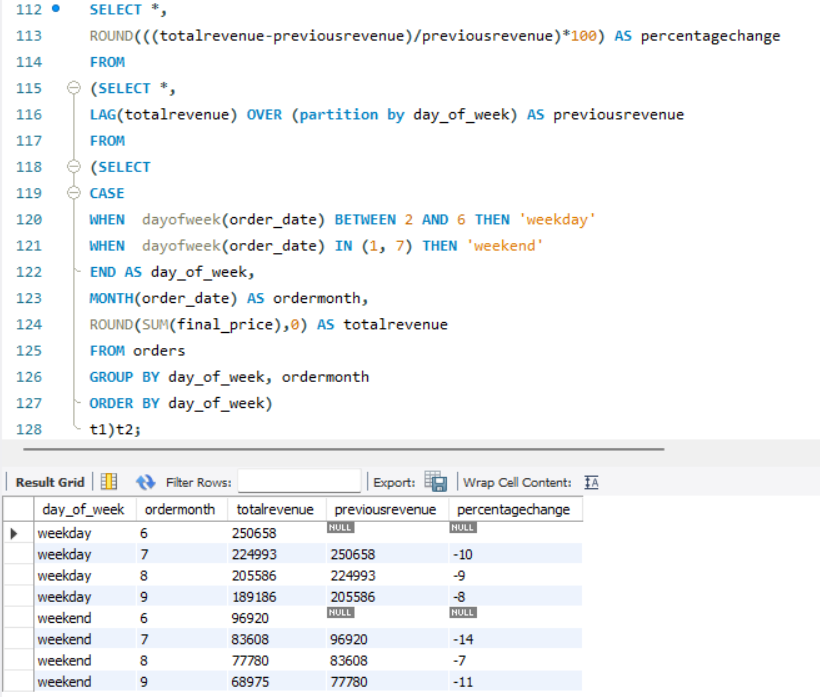
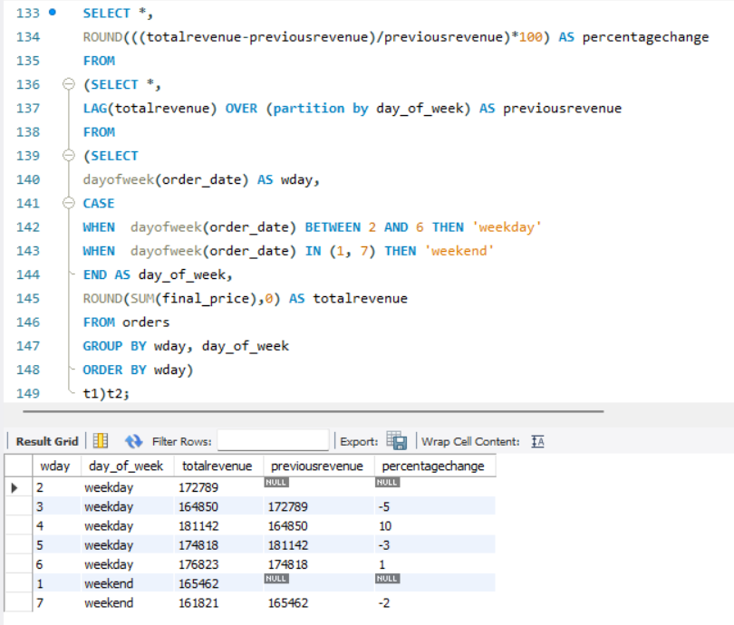
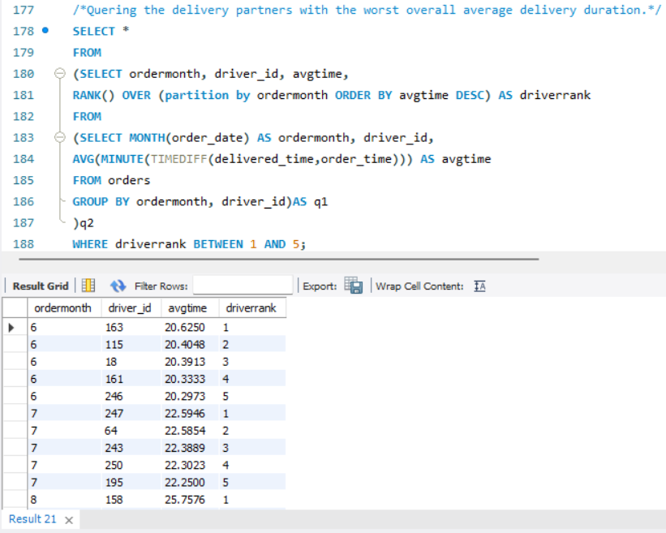
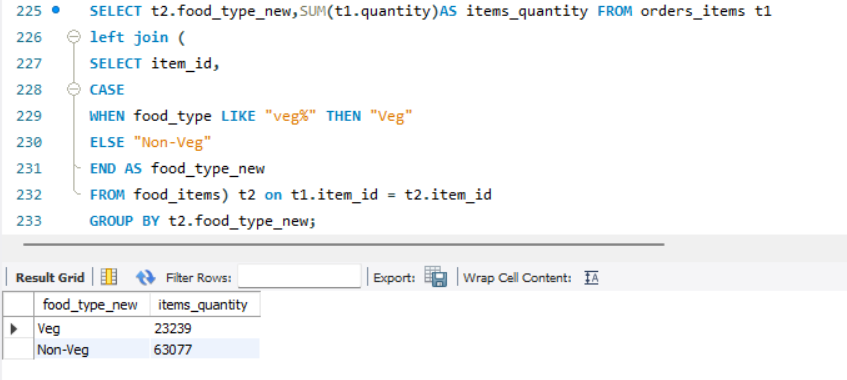
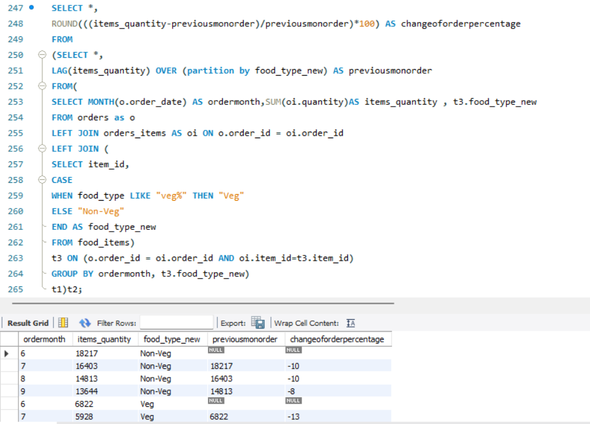
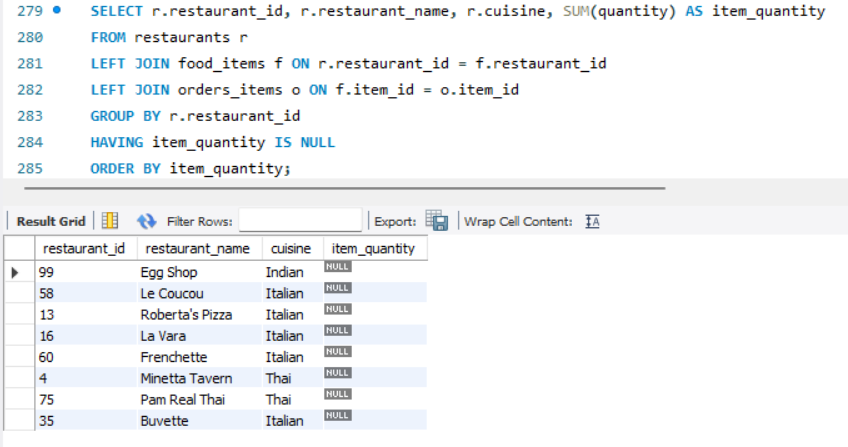
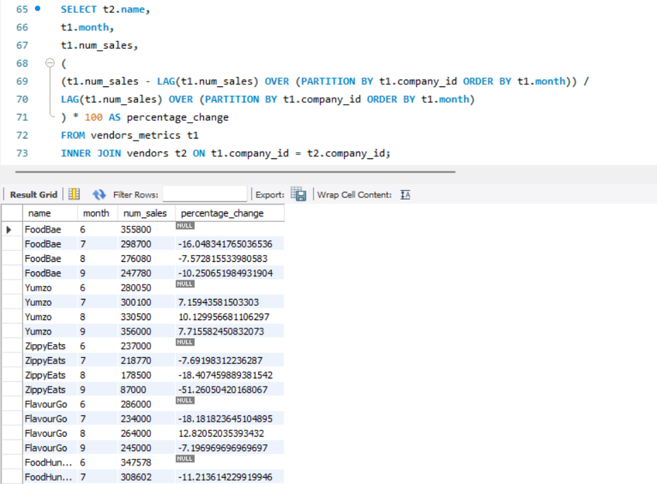

# Food Hunter Revenue Analysis 

## Introduction
Food Hunter, a well-funded food delivery app, offers a diverse selection of restaurants and multiple cuisines, paired with quick delivery services. However, the company has observed a consistent decline in monthly revenues over the last quarter. To address this issue, Food Hunter seeks to identify the various factors contributing to the downturn in business. The project aims to analyse the data available at the order level, encompassing details such as cuisines, restaurants, delivery time ratings, and more, to uncover the reasons behind the revenue decline.
## Objective
The primary objective is to utilize SQL queries to extract, analyze, and interpret the data to identify trends, patterns, and potential factors negatively impacting Food Hunter's business. Additionally, a competitive analysis will be performed using two newly provided tables - Vendors and Vendors Metrics - to compare Food Hunter's performance against competitors.
## Data Overview
The Food Hunter database comprises six tables, each containing vital information for the analysis:

1.	Customers: Contains details about the customers who place orders.

2.	Orders: Records information related to each order placed through the app.

3.	Food Items: Lists the food items available for delivery, along with associated details.

4.	Order Items: Contains data on the specific items included in each order.

5.	Restaurants: Provides information on the various restaurants partnered with Food Hunter.

6.	Drivers: Includes data about the drivers responsible for delivering the orders.
## Task
1. Data Extraction: Utilize SQL queries to extract relevant data from the six tables.

2. Data Cleaning and Transformation: Ensure data accuracy and consistency through cleaning and transformation processes.

3. Data Analysis: Apply SQL functions, including JOINs, aggregation, and analytical functions like LAG, to analyze the data.
## Data & Resource Used

**Dataset**

Option 1: [Kaggle](https://www.kaggle.com/datasets?fileType=csv)

Option 2: And, also the dataset can be found on [Fractal Analytics](https://www.coursera.org/learn/data-analysis-sql) Coursera Course. I am grateful for his guidance on this project.

**Tool** 

MySQL Workbench
## Data Cleaning and Preparation
### 1. Extract the data by utilize SQL queries to extract relevant data from the six tables.
Checking NULL values, blanks and Errors.

Removing duplicates, and irrelevant columns.

Ensure data consistency and accuracy through cleaning and transformation processes.
### 2. Create a schema, which is nothing but a database.

Ensure the tables includes all required columns for analysis.

Load .sql script on the query editor and run the script to load all tables in database.

Explore the different tables that are present in the Food Hunter database
### 3. Key Analysis Areas
1. Revenue related factors

2. Time-based problems

3. Delivery partners problems

4. Time of day

5. Competitor Analysis
## Data Analysis

1.	**Revenue Analysis: Revenue related factors**
	
i. Analyze monthly revenue trends and identify any significant fluctuations.

ii. Determine the impact of various cuisines, restaurants, and delivery times on revenue.

2.	**Customer Behavior: Time-based problems**
3.	
i. Investigate customer ordering patterns, including frequency, order size, and cuisine preferences.

ii. Analyze customer demographics to identify any specific groups contributing to the revenue decline.

3.	**Delivery Performance: Delivery partners problems**
4.	
i. Examine delivery times and ratings to assess the quality of service.

ii. Identify any correlations between delivery times, ratings, and customer satisfaction.

4. **Restaurant and Food Item Analysis: Time of day**
5. 
i. Evaluate the performance of different restaurants and food items.

ii. Identify top-performing and underperforming restaurants and items.

5. **Competitor Analysis:**
6. 
i. Compare Food Hunter's monthly revenue against competitors using the Vendors and Vendors Metrics tables.

ii. Calculate the percentage difference in monthly revenue and analyze the month-on-month changes.

## Key Findings
### 1.Revenue related factors
•	**Checking the total revenue of each month in orders table.**

		**Note:** Outcome of the above query we detect that downfall in terms of sales or revenue

•	**Looking at total discount with total revenue over the months.**   

		**Note:** The ratio is consistent throughout the four months with discounts around 13%. Hence we can conclude that there was no variation in discounts or offers. So it is not one of the reasons for a drop in sales.

  

### 2.Time-based problems   
•	**Looking at the variation of sales over days.**   

		**Note:** weekdays have more number of orders compared to weekends.

 

•	**Finding the percentage change in revenue for the months.**   

		**Note:** we can conclude that there is something going wrong in the the weekend sales. The weekend sales need to be improved substantially to help Food Hunter regain their revenue.

•	**Finding the percentage drop of revenue for days of the week, that is Monday, Tuesday, Wednesday and so on.**   

### 3.Delivery partners problems
•	**Querying the delivery partners with the worst overall average delivery duration.**   

		**Note:** As you have seen that there is an increase in delivery duration over the last four months. Food Hunter should learn from best practices of best delivery partners and share learning with the rest of the delivery partners to improve delivery time

### 4.Time of day
•	**Finding the percentage changes in the revenue across four time segments over four months.**   

		**Note:** Clearly, non-veg orders have an upper hand of almost 2.5 times, thus confirming that our customers prefer to order non-veg from Food Hunter platform. Now that we know which food type is preferred by the customers, Food Hunter should try and diversify their non-vegetarian options and provide more cuisines to the customers. This can certainly help boost their sales even further. We have found the value for the number of orders is based on the food preferences.

 

•	**Looking for the percentage change in food preferences for each month.**   

		**Note:** The change% is consistent throughout the four months in Non-Veg around 10%. But, the change% is inconsistent throughout the four months in Veg like 13%, 9%, and 6%. Hence we can conclude that we know which food type is preferred by the customers, Food Hunter should try and diversify their vegetarian and non-vegetarian  options and provide more cuisines to the customers. This can certainly help boost their sales even further. We have found the percentage change in food preferences for each month based on the number of orders is based on the food preferences.

•	**Looking for the number of items ordered from each of the restaurants.**   

		**Note:** We have retrieved the list of restaurants that have 0 items ordered along with their cuisines. Out of the eight restaurants that we have over here, a pattern can be seen, notice that six of them are Italian restaurants. It could be that the customers aren't happy with the options in the menu or that the prices aren't suitable. But we don't have enough information in terms of the customer feedback in order to confirm this. 

•	**Solution**   

		**Action to Take:** But one thing is for certain, and that is that Food Hunter can regain its reputation in the market with a few major tweaks in marketing, delivery times, and by providing better offers and discounts.

### 4.Competitor Analysis
•	**Finding the percentage difference in monthly revenue and analyze the month-on-month changes**   

		**Note:** While observing that different food delivery applications seems to have different trends based on the monthly revenue. While FoodBae has a similar downward trend to food Hunter, Yangzhou seems to have a month to month increase in revenue as you can see over here. On the other hand, Zippy Eats has been facing an extreme downfall in the revenue, which you can see over here. There isn't a particular trend with mixed variations and the revenue for FlavourGo, as you can see over here. Thus, you can conclude that this downfall in revenue is more or less Food Hunter centric. They need to fix the issues in order to get back on track with their competitors. 

## Conclusion
The analysis aims to provide actionable insights into the factors contributing to the decline in Food Hunter's monthly revenues. The findings will help the company strategize improvements in customer satisfaction, service quality, and competitive positioning.
## Recommended Analysis
•	Further analysis of customer feedback and reviews to enhance service quality.

•	Implementation of predictive analytics to forecast future trends and identify potential growth areas.

•	Exploration of additional data sources, such as marketing and promotions data, to provide a more comprehensive analysis.
## Reflection
This project highlights the importance of data-driven decision-making in identifying business challenges and opportunities. The use of SQL for data extraction and analysis enabled a detailed examination of various aspects of the business, providing a solid foundation for strategic improvements.
